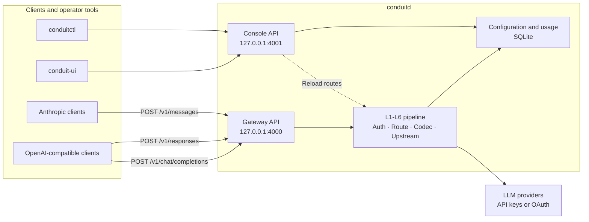

# Conduit

Local-first LLM gateway with routing, protocol translation, and usage accounting.

Conduit exposes OpenAI-compatible (Chat Completions and Responses) and Anthropic Messages endpoints, forwards requests to configured providers, and keeps operational data on your machine. It consists of a Rust daemon (`conduitd`), an operator CLI with interactive TUI (`conduitctl`), and an optional Tauri + Svelte desktop console (`conduit-ui`).

> [!WARNING]
> Conduit is pre-release software under active development. Configuration and storage formats may change without migration support. There are no official binary releases yet; build from source for development and evaluation.

## Why Conduit?

- **Local-first operation**: configuration, secrets, and usage records remain on the host running Conduit.
- **Compatible ingress APIs**: supports OpenAI Chat Completions, OpenAI Responses, and native Anthropic Messages requests, including streaming.
- **Multi-provider routing**: fixed, weighted, and ordered fallback strategies with retry handling.
- **Faithful protocol translation**: codec losses are explicit (`LossReport`) instead of being silently discarded.
- **Usage ledger**: per-request tokens and cost for operator spend queries.
- **Operator tooling**: inspect and configure the gateway through the `conduitctl` TUI, one-shot CLI subcommands, or the optional desktop console.
- **OAuth provider support**: includes Claude, Codex, and Grok subscription-account flows in addition to API-key providers.

## Project Status

The core gateway path, provider and route management, streaming, usage accounting, pricing, and operator console are implemented. The project is not yet production-ready: release automation, versioned database migrations, end-to-end test coverage, and several community files are still in progress.

## Architecture



Requests pass through a layered pipeline: transport, ingress filters, routing, codec translation, upstream transport, and egress accounting (usage/cost ledger). The routing decision is pure and deterministic; configuration and usage records use SQLite.

For crate boundaries, storage details, security trade-offs, and codec contracts, read [ARCHITECTURE.md](ARCHITECTURE.md).

## Supported APIs and Providers

### Ingress APIs

| API | Endpoint | Streaming | Notes |
| --- | --- | --- | --- |
| OpenAI Chat Completions | `POST /v1/chat/completions` | Yes | Classic chat `messages` shape |
| OpenAI Responses | `POST /v1/responses` | Yes | First-class ingress; local `previous_response_id` continuation when `store` is enabled |
| OpenAI Responses Compact | `POST /v1/responses/compact` | No (non-stream only) | Context compaction for Codex; preserves `compaction_trigger` and proxies to upstream `/responses/compact` |
| Anthropic Messages | `POST /v1/messages` | Yes | Native Anthropic wire format |
| OpenAI Models | `GET /v1/models` | N/A | Lists route aliases; includes `context_window` / `context_length` when model limits are known |

Clients can speak Chat Completions or Responses on the gateway; Conduit translates to the selected upstream protocol (including Responses-native providers such as Codex and Grok chat-proxy).

### Provider kinds

| Kind | Authentication | Upstream protocol | Notes |
| --- | --- | --- | --- |
| `openai` | API key | Chat Completions | OpenAI-compatible chat upstreams |
| `anthropic` | API key | Messages | Anthropic Messages upstreams |
| `claude-oauth` | OAuth + PKCE | Messages | Claude subscription account |
| `codex-oauth` | OAuth + PKCE | Responses | ChatGPT Codex `/responses` |
| `grok-oauth` | OAuth device flow | Responses | Grok CLI chat-proxy `/v1/responses` |

Provider compatibility is evolving; treat codec edge cases and OAuth flows as best-effort until a release is cut.

## Getting Started

### Prerequisites

- Rust stable toolchain with Cargo
- Node.js and pnpm for the optional desktop console
- Tauri 2 platform prerequisites for your operating system if you run the desktop console

The repository currently builds with Rust 1.94 and pnpm 10. Earlier versions may work but are not tested here.

### 1. Build the daemon and CLI

```bash
git clone <repository-url>
cd conduit
cargo build -p conduitd -p conduitctl
```

This repository does not currently declare a public Git remote, so replace `<repository-url>` with the URL of your fork or checkout source.

### 2. Start the daemon

```bash
cargo run -p conduitd
```

If `conduit.toml` is absent, Conduit uses its built-in defaults:

- gateway: `http://127.0.0.1:4000`
- console API: `http://127.0.0.1:4001`
- data directory: `~/.conduit`
- tracing: enabled

Confirm that the daemon is available:

```bash
cargo run -p conduitctl -- status
```

### 3. Configure with the interactive TUI

In a second terminal:

```bash
cargo run -p conduitctl -- tui
# or, with a TTY and no subcommand:
cargo run -p conduitctl
```

Use the **Providers** tab to add an API-key provider or the **OAuth** tab to start a login. Then use **Routes** to map the model name sent by clients, such as `gpt-4o`, to an upstream provider and model. Press `?` inside the TUI for the full key map.

Optional desktop console (`conduit-ui`):

```bash
cd conduit-ui
pnpm install --frozen-lockfile
pnpm tauri dev
```

Each route target can also define **Request overrides** as a JSON object. These
static fields are applied only when that target is selected, after Conduit has
encoded the upstream protocol. This is useful for provider-specific options
that VS Code and other clients cannot place in their request body. For example,
set the following on a `codex-oauth` target for `gpt-5.6-terra` to enable its
Fast service tier:

```json
{"service_tier":"priority"}
```

Conduit does not allow overrides to replace gateway-controlled fields: `model`,
`stream`, `store`, `input`, and `messages`.

The console connects to `http://127.0.0.1:4001` by default. Set `VITE_CONDUIT_CONSOLE_URL` before starting it to use another console address.

### 4. Send a request

After configuring a provider and a route, send an OpenAI-compatible request. Use the downstream key created in the **Keys** view as a bearer token.

**Chat Completions:**

```bash
curl http://127.0.0.1:4000/v1/chat/completions \
  -H 'content-type: application/json' \
  -H 'authorization: Bearer <conduit-key>' \
  -d '{
    "model": "gpt-4o",
    "messages": [{"role": "user", "content": "Hello from Conduit"}]
  }'
```

**Responses** (same route alias; useful for Codex / Grok clients and Responses-native SDKs):

```bash
curl http://127.0.0.1:4000/v1/responses \
  -H 'content-type: application/json' \
  -H 'authorization: Bearer <conduit-key>' \
  -d '{
    "model": "gpt-4o",
    "input": "Hello from Conduit",
    "store": true
  }'
```

With `"store": true`, subsequent turns may pass `previous_response_id` and Conduit will expand the continuation from local state when needed.

Inspect usage and spend in the TUI **Usage** tab (metric cards, daily bars, by-model /
by-key share bars — inspired by [tokscale](https://github.com/junhoyeo/tokscale)), or with
one-shot CLI commands:

```bash
cargo run -p conduitctl -- usage summary
cargo run -p conduitctl -- usage list --limit 50 --offset 0 --sort date
cargo run -p conduitctl -- usage list -q gpt-4o --sort cost
```

TUI **Usage** tab: default sort is date (newest first); `/` filters; **PgUp/PgDn** pages the
recent list (50 per page). `c` cycles sort (`date` → `cost` → `tokens`); `[`/`]` change month.


Manage **operator pricing overrides** (`pricing.json`, USD per MTok) like tokscale
custom-pricing:

```bash
cargo run -p conduitctl -- pricing overrides
cargo run -p conduitctl -- pricing set --provider openai --model my-model --input 1.0 --output 4.0
cargo run -p conduitctl -- pricing unset --provider openai --model my-model
```

In the TUI Pricing tab: `o` toggles merged table ↔ overrides, `a`/`e`/`d` edit overrides.

Run `cargo run -p conduitctl -- --help` or append `--help` to any subcommand for the complete CLI reference.

## Configuration

Conduit works without a configuration file. To override the defaults, create a `conduit.toml`. When `--config` / `CONDUIT_CONFIG` is not set, conduitd looks for `conduit.toml` in the working directory, then falls back to `~/.conduit/conduit.toml`; the first that exists is used. A config file that is present but malformed is a fatal error (conduitd will not silently fall back to defaults).

```toml
# Upstream HTTP/SOCKS proxy for OAuth and token requests (optional).
proxy_url = "socks5://127.0.0.1:7890"

# Master password for secret encryption. Prefer CONDUIT_MASTER_PASSWORD
# so the password is not stored on disk in plaintext.
master_password = "change-me"

[gateway]
port = 4000
console_port = 4001

[log]
level = "info"       # log filter, e.g. "debug,sqlx::query=off"
format = "pretty"    # "pretty" or "json"
to_file = true       # write to a daily-rolling file, or false for stdout
dir = "~/.conduit/logs"   # defaults to <data-dir>/logs
```

Every field — and every section, including `[gateway]` and `[log]` — is optional; omit the file entirely to use the built-in defaults, or include just the one section you want to change. For each setting that also has an environment variable or CLI flag (the logging fields, `master_password`, and the gateway port), the resolution order is **environment variable / CLI flag → `conduit.toml` → built-in default** — the environment always wins. The only settings that live *only* in the environment (never the config file) are `CONDUIT_CONFIG`, `CONDUIT_DATA_DIR`, and the `conduitctl` / desktop variables.

The upstream proxy for OAuth and token requests is resolved from several sources, highest priority first: a per-credential `proxy_url` → `CONDUIT_PROXY_URL` → the `proxy_url` field in `conduit.toml` → the standard `HTTPS_PROXY` / `HTTP_PROXY` / `ALL_PROXY` variables (with `NO_PROXY` for bypass).

### Environment variables

| Variable | Component | Default | Purpose |
| --- | --- | --- | --- |
| `CONDUIT_CONFIG` | `conduitd` | `./conduit.toml`, then `~/.conduit/conduit.toml` | Configuration file path |
| `CONDUIT_PORT` | `conduitd` | `4000` | Gateway port override |
| `CONDUIT_DATA_DIR` | `conduitd` | `~/.conduit` | Local state directory |
| `CONDUIT_MASTER_PASSWORD` | `conduitd` | _(empty)_ | Master password for secret encryption; also settable via `master_password` in `conduit.toml` |
| `CONDUIT_LOG` | `conduitd` | `info` | Log filter, for example `debug,sqlx::query=off`; also `[log] level` in `conduit.toml` |
| `CONDUIT_LOG_FORMAT` | `conduitd` | `pretty` | `pretty` or `json`; also `[log] format` in `conduit.toml` |
| `CONDUIT_LOG_TO_FILE` | `conduitd` | `true` | Write logs to a daily-rolling file; set `false` to log to stdout (e.g. under systemd/journald); also `[log] to_file` in `conduit.toml` |
| `CONDUIT_LOG_DIR` | `conduitd` | `<data-dir>/logs` | Directory for log files when file logging is enabled; also `[log] dir` in `conduit.toml` |
| `CONDUIT_PROXY_URL` | `conduitd` | _(unset)_ | Upstream HTTP/SOCKS proxy; also settable via `proxy_url` in `conduit.toml` (see the precedence note above) |
| `CONDUIT_CONSOLE_ADDR` | `conduitctl` | `http://127.0.0.1:4001` | Console API base URL |
| `CONDUIT_OUTPUT` | `conduitctl` | `human` | `human` or `json` where supported |
| `VITE_CONDUIT_CONSOLE_URL` | `conduit-ui` | `http://127.0.0.1:4001` | Desktop console API base URL |

> [!IMPORTANT]
> The console API is an operator interface and currently has no independent authentication layer. Keep it bound to a trusted loopback interface and do not expose port `4001` to untrusted networks.

## Data and Security

By default, Conduit stores its state under `~/.conduit`:

| Data | Storage |
| --- | --- |
| Providers, routes, keys | SQLite |
| Usage records | SQLite |
| Provider secrets | AES-256-GCM files under `{data_dir}/secrets/` (Argon2id KEK from master password) |

Set `CONDUIT_MASTER_PASSWORD` (or `--master-password`) before storing production API keys. An empty password is allowed for local development only and is warned at startup. Treat the data directory as sensitive and read the full [security model](ARCHITECTURE.md#security-model).

## Development

Run the Rust quality gates from the repository root:

```bash
cargo fmt --all --check
cargo clippy --workspace --all-targets -- -D warnings
cargo test --workspace
cargo deny check
```

Run the desktop console checks from `conduit-ui`:

```bash
pnpm install --frozen-lockfile
pnpm check
pnpm test
pnpm build
```

Useful focused commands:

```bash
cargo test -p conduit-codec
cargo test -p conduit-router
cargo test -p conduitd
cargo run -p conduitd -- --help
cargo run -p conduitctl -- --help
```

### Repository layout

```text
crates/
  conduit-ir/        Canonical request, response, usage, and span/content types
  conduit-codec/     OpenAI, Anthropic, and Responses wire codecs
  conduit-router/    Pure routing decisions and retry policies
  conduit-upstream/  Provider HTTP clients and SSE handling
  conduit-oauth/     Claude, Codex, and Grok OAuth flows
  conduit-secret/    Secret backend implementations
  conduit-store/     SQLite configuration, pricing, and usage repositories
  conduit-quota/     Rate limiting and usage hooks
  conduit-pipeline/  End-to-end request orchestration
  conduitd/          Gateway daemon and console API
  conduitctl/        Operator CLI
conduit-ui/          Tauri 2 + Svelte 5 desktop console
```

## Contributing

Contributions are welcome while the project is taking shape. Before opening a change:

1. Keep changes focused and preserve Conduit's faithful-proxy guarantees.
2. Add or update tests for behavior changes.
3. Run the Rust and UI quality gates relevant to your change.
4. Explain user-visible behavior, compatibility impact, and storage changes in the pull request.

A dedicated contribution guide, issue templates, and pull request template have not been added yet.

## Security

Do not report suspected vulnerabilities in a public issue. This repository does not yet publish a private disclosure address or response SLA. Until a security policy is added, contact the repository owner through a private channel available on the hosting platform.

## License

No license has been selected or included yet. Until a `LICENSE` file is added, copyright law reserves all rights and the source is **not** licensed for redistribution or modification. Do not describe this repository as open source solely because its source is visible.
